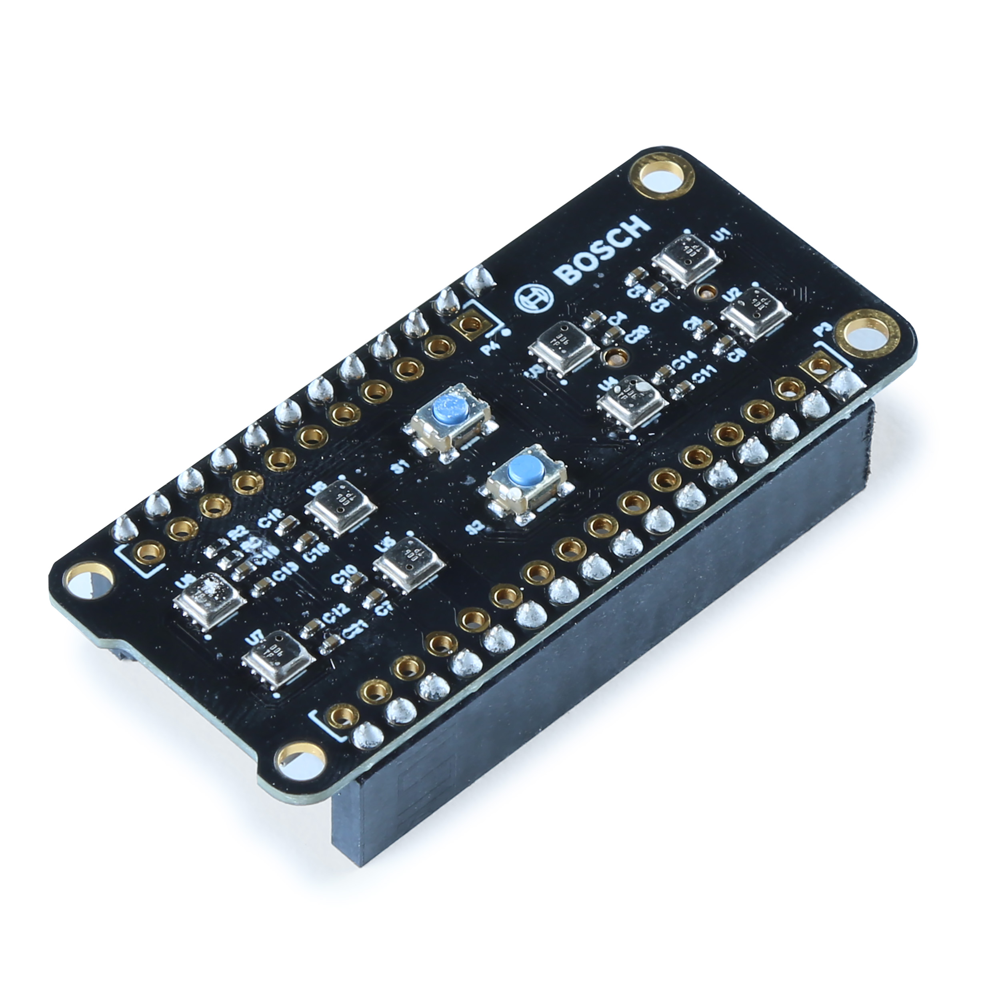
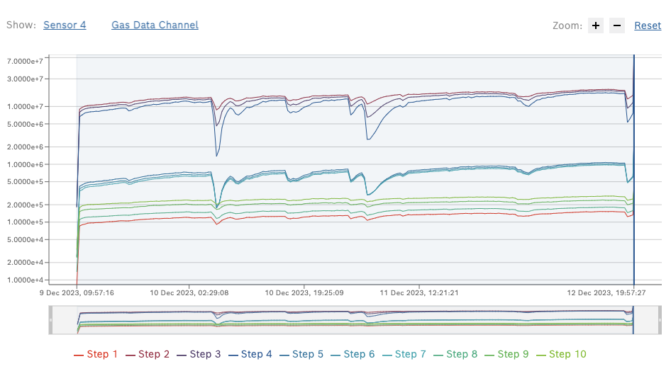
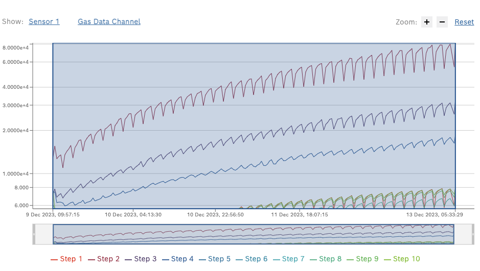
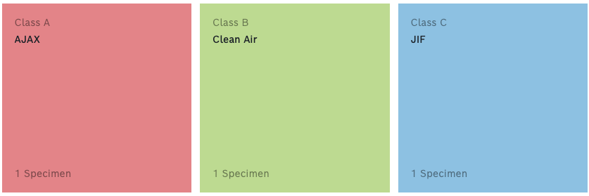
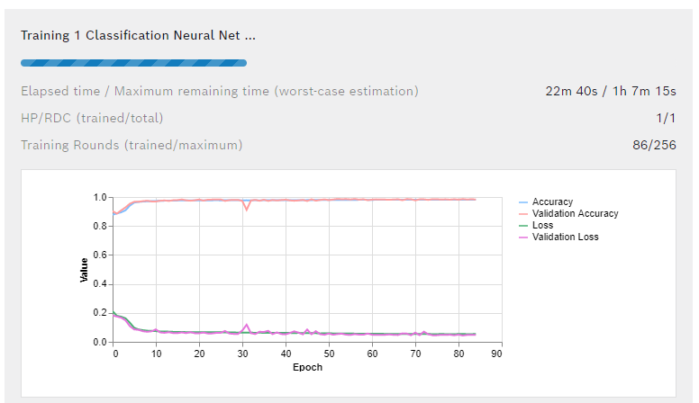
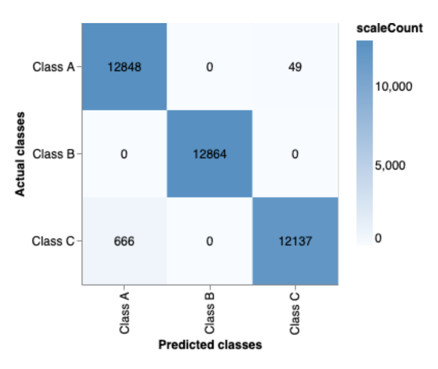
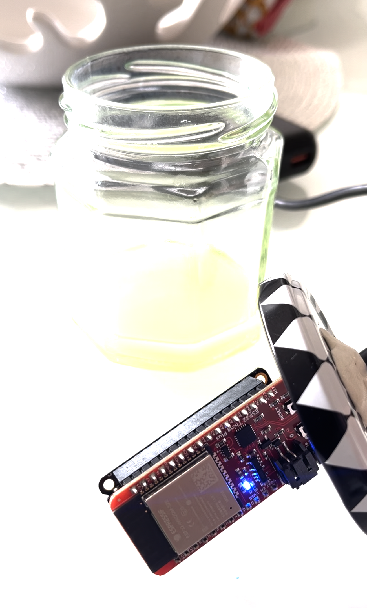
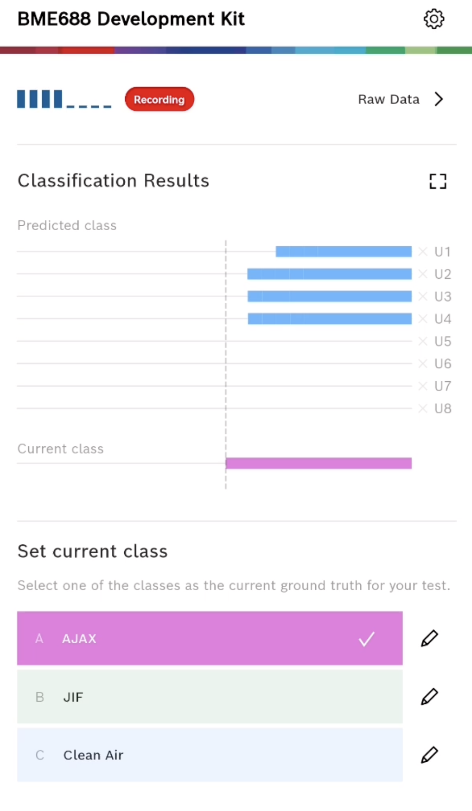
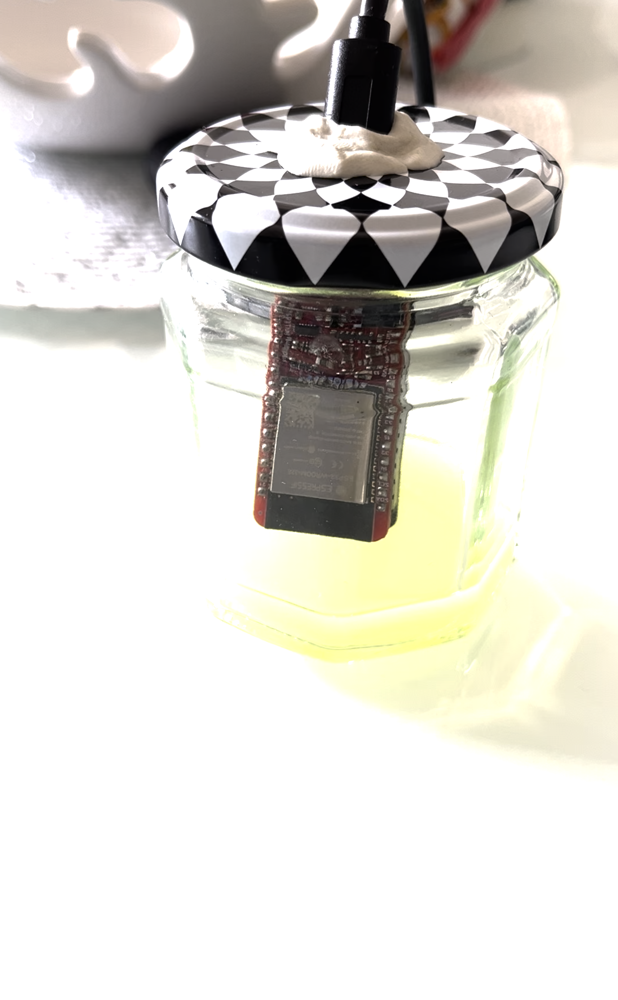
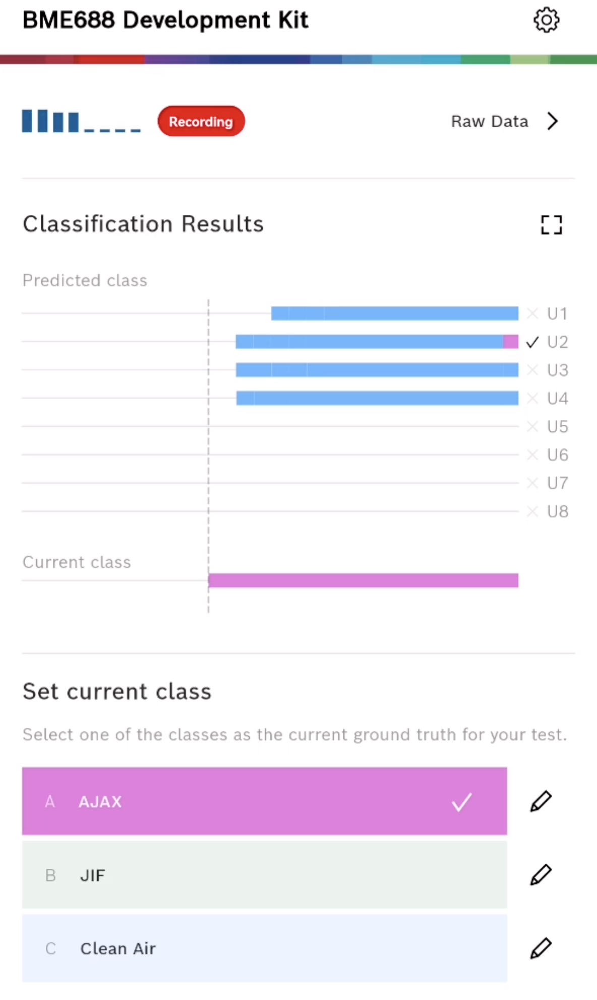

# iotlab-pilotcase-jemac

Jemac Sweden AB is a company based in Kalmar, Sweden. They provide services within development, production, and management. They work with a broad spectrum of commissions for different types of customers and have an extensive network of partners. They also offer products and services that connect you to your things. They can design, set up, and manage the implementation of your complete system including hardware, software, connectivity, cloud services, and user interface. They also develop and design user-friendly apps to control and monitor your things from any type of device.

# Table of contents

- [iotlab-pilotcase-jemac](#iotlab-pilotcase-jemac)
- [Table of contents](#table-of-contents)
- [Values to measure](#values-to-measure)
  - [Internal Measurements:](#internal-measurements)
  - [External Measurements:](#external-measurements)
- [Measurement description](#measurement-description)
  - [Temperature and humidity](#temperature-and-humidity)
  - [Air quality](#air-quality)
  - [Motion](#motion)
    ∏

# Values to measure

The concept of a soundproof pod comes with various potential areas of measurement, both internally and externally. These values could be temperature, humidity, multi-faceted air quality, motion, sound, light and fire detection from within, alongside external temperature and sound. All such measurements pave the way to fully understanding and improving the pod's performance and efficiency, ensuring optimal user comfort and safety.

## Internal Measurements:

- Temperature

  - Ensures comfort levels for enhanced productivity.
  - Provides early warnings for equipment malfunctions or overheating.
  - Optimizes energy usage through smarter HVAC control.

- Humidity

  - Helps maintain an environment that minimizes respiratory discomfort or diseases.
  - Protects sensitive equipment from humidity damage.
  - Alerts to potential water leaks within the pod.

- Air Quality (High Priority)

  - Improves overall health by reducing exposure to airborne pollutants.
  - Identifies the presence of harmful gases or chemical leaks.
  - Particle sensors detect allergens providing a more accommodative environment for user health.

- Motion Sensing

  - Tracks usage patterns, optimizing energy management.
  - Integrates with emergency systems for improved safety.

- Sound Levels

  - Ensures the pod remains a sound-free zone for focused tasks.
  - Detects anomalies, serving as an alert system for potential equipment issues.

- Light Intensity

  - Delivers a mood-appropriate environment for varying activities.
  - Reduces eye strain and associated health issues.
  - Optimizes light-based energy consumption.

- Fire Detection
  - Satisfies safety compliance and insurance requirements.
  - Make sure that the person inside the pod hears the outside fire alarm

## External Measurements:

- Ambient Sound

  - Assesses the pod's soundproofing effectiveness.
  - Alerts to external disruptions or hazards.
  - Provides insights to improve design and materials for better noise isolation.

- Ambient Temperature
  - Regulates internal control systems for a consistent indoor climate.
  - Helps swiftly detect and adapt to outdoor climate changes.
  - Contributes to energy optimization while minimizing wastage.

# Measurement description

## Temperature and humidity

## Air quality

Air quality can be measured in various ways, each representing different elements, compounds or conditions present in the environment. From gaseous compounds like CO2, NOx, and VOCs to solid particulates like PM2.5 and PM10, and even environmental conditions like temperature and humidity, each contributes to the overall quality of the air we breathe.

- **CO2**: Measuring Carbon dioxide can be a way to detect if someone is in the pod, as well as a way to know if further ventilation is needed

- **eCO2**:
  eCO2: Stands for equivalent Carbon Dioxide, used in measurements for indoor air quality applications, and based primarily on the sensing of VOCs (Volatile Organic Compounds).

- **PM**: A common way to measure particles is to count them by size. PM2.5 and PM10 are terms used to describe fine particles in the air we breathe. They refer to atmospheric particulate matter (PM) that has a diameter of less than 2.5 micrometers and 10 micrometers, respectively. Measuring particles can be a way to monitor overall air quality, but also a way to indicate if someone smokes in the pod.

- **VOC**: Volatile Organic compound is a group of chemicals that evaporate easily at room temperature. They are produced by many household products such as paints, aerosols, and cleaners, as well as industrial processes. High levels of VOCs can have harmful effects on health and also contribute to air pollution.
  There are air quality sensors available that offer a combination of ways to measure air Quality

- **TVOC**: Total Volatile Organic Compounds refer to the total concentration of multiple airborne VOCs present in the environment at a given time.

- **NOx**: It's the collective term for nitric oxide (NO) and nitrogen dioxide (NO2). They are harmful gases released by burning fuels and can cause respiratory problems and contribute to the formation of smog and acid rain.

- **AQI**: The Air Quality Index is a standard scale for reporting and forecasting air quality. It helps people understand when to reduce outdoor activities if the air quality is unhealthy.

- **VSCs**: Volatile Sulfur Compounds, a category of compounds with a low boiling point, often responsible for unpleasant odors. They can also impact air quality, especially indoors.

## Motion

Presence detection using sensors is a crucial technology in numerous applications like automation, security, and energy efficiency. These sensors operate without human intervention, employing various methods to detect physical presence. The most common types include Passive Infrared (PIR) Sensors, Thermal sensors, and Ultrasonic Sensors.

- **Passive Infrared (PIR) Sensors:** These sensors detect body heat, and are commonly used in home security systems. They are passive because they don't emit energy; they simply detect it. Can have false triggers in the form of other heat sources.

- **Thermal:** Both the pyroelectric sensor (Often used in PIR) and non-contact MEMS thermal sensor can detect even the slightest amount of radiant energy from objects such as infrared radiation and convert them into temperature readings. However, unlike pyroelectric sensor that relies on motion detection, non-contact MEMS thermal sensors can detect the presence of stationary humans (or objects).

- **Ultrasonic Sensors:** These sensors emit ultrasonic waves, and then measure the reflection of a moving object. They are commonly used in automated doors, light switches, or parking sensors in cars.

# Results

We decided to test and evaluate the BME688 sensor from Bosch. What sets the BME688 apart is its capability for AI-based gas identification. By using machine learning algorithms, it can be trained to recognize specific gas patterns. For instance, if you want to detect a particular gas unique to your application, you can collect data from the sensor and use AI techniques to create a custom gas identification model. This adaptability makes the BME688 valuable in scenarios where specific gas detection is essential. Here is how we trained the BME688 to detect cleaning chemicals.

A [development kit](https://www.sparkfun.com/products/19630) consisting of 8 individual BME688 sensors was used to collect data along with a [Thing Plus - ESP32 WROOM (Micro-B)](https://www.sparkfun.com/products/15663)

## Software and versions

The table below shows the software and versions used in the experiment.

| Software                           | Version  | Release Date |
| ---------------------------------- | -------- | ------------ |
| BSEC 2.x                           | v2.5.0.2 | Feb 2024     |
| BME AI-Studio Desktop for macOS    | v2.3.2   | Feb 2024     |
| BME AI-Studio Mobile App (Android) | v2.4.16  | Feb 2024     |

Documentation for the BME688 sensor can be found [here](https://www.bosch-sensortec.com/software/bme/docs/overview/getting-started.html).

## Collecting data

Before any data collection and training, we had to calibrate the sensor by running it for 48 hours in a clean-air environment.

We collected data from the BME688 sensor in a controlled environment. We used a glass with a small amount of cleaning chemicals and let the sensor collect data for some time. We repeated this process for different cleaning chemicals. The table below shows the data collected for the different cleaning chemicals and for clean air, as well as the duration of the data collection.

|               | \*Temperature (°C) | \*Humidity (%) | \*Pressure (hPa) | \*Gas Resistance (kΩ) | Duration (hours) |
| ------------- | ------------------ | -------------- | ---------------- | --------------------- | ---------------- |
| Reference air | 35.21              | 14.24          | 1015.12          | 15734.17              | 72h 0m 0s        |
| Ajax          | 37.64              | 37.04          | 1019.07          | 6.33                  | 72h 0m 0s        |
| Jif           | 38.28              | 37.09          | 1028.18          | 14.54                 | 72h 0m 0s        |

\*The data collected is the average of the data collected throughout the experiment.

The image below shows the resistance change over time when the sensor was exposed to clean air. The average resistance here was 15734174.72Ω or 15.73 MΩ

Whereas the image below shows the resistance change over time when the sensor was exposed to the cleaning chemical Jif. The average resistance here was 14535.18Ω or 14.54 kΩ

Compared to the reference air, the resistance change for the cleaning chemicals was significant. This is a good indication that the sensor can be trained to detect different chemicals with different gas characteristics.

## Training the BME688

We used the BME AI-Studio Desktop to train the BME688 sensor. The BME AI-Studio Desktop is a powerful tool that allows you to train the BME688 sensor to detect specific gas patterns.

We created three classes, one for each gas, and trained the sensor using the data collected. Each class is given a set of data (or specimen), and the sensor is trained to recognize the patterns in the data. More on the format of specimen data can be found [here](https://www.bosch-sensortec.com/software/bme/docs/technical-specification/bmespecimen.html).

The specimen data contained gas resistance, humidity, and pressure as features since these noticeably changed when the sensor was exposed to the different cleaning chemicals. The temperature was not included as it did not change significantly. The data was also split into training and testing data, with 80% of the data used for training and 20% for testing.

The result of the training was a model that could detect the different cleaning chemicals with an accuracy of 98.5%. This is a good indication that the sensor can be used to detect different chemicals with different gas characteristics.

<table>
<tr>
<td width="50%">
<figure>

| Metric          | Value  |
| --------------- | ------ |
| Accuracy        | 98.15% |
| F1 Score        | 98.18% |
| False/Positive  | 1.78%  |
| Training Data   | 80%    |
| Validation Data | 20%    |

<figcaption><strong> Training Model Metrics</strong></figcaption>

</figure>
</td>
<td width="50%">
<figure>

<figcaption><strong>Confusion Matrix</strong></figcaption>

</figure>
</td>
</tr>
</table>

The confusion matrix above shows the performance of the model. The diagonal elements represent the number of points for which the predicted label is equal to the true label, while off-diagonal elements are those that are mislabeled by the classifier.

## Testing the model

We tested the model using the BME AI-Studio Mobile App. The BME AI-Studio Mobile App is a tool that allows us to test the BME688 sensor in real-time. We used the app to test the sensor with the different cleaning chemicals and clean air.

Here is a screenshot of the app showing the sensor detecting clean air.

<table>
<tr>
<td width="50%">
<figure>

<figcaption><strong>BME688 in clean air</strong></figcaption>

</figure>
</td>
<td width="50%">
<figure>

<figcaption><strong>Detection of clean air</strong></figcaption>

</figure>
</td>
</tr>
</table>

Here is a screenshot of the app showing the sensor detecting the cleaning chemical AJAX. U2 detects the cleaning chemical AJAX, the rest (U1, U3 and U4) eventually detects AJAX too.

<table>
<tr>
<td width="50%">
<figure>

<figcaption><strong> BME688 Dev kit exposed to AJAX</strong></figcaption>

</figure>
</td>
<td width="50%">
<figure>

<figcaption><strong>U2 detects AJAX</strong></figcaption>

</figure>
</td>
</tr>
</table>
